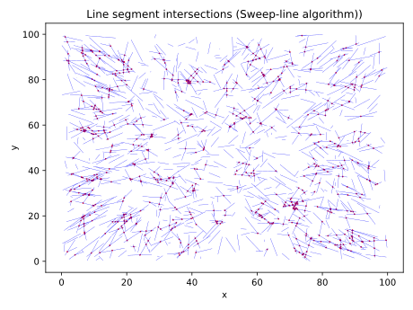
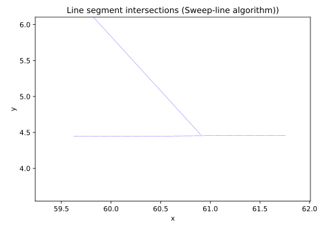
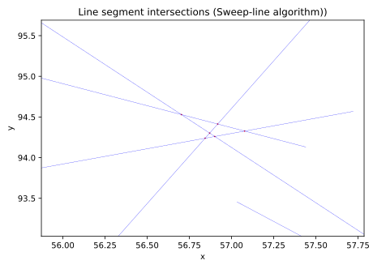
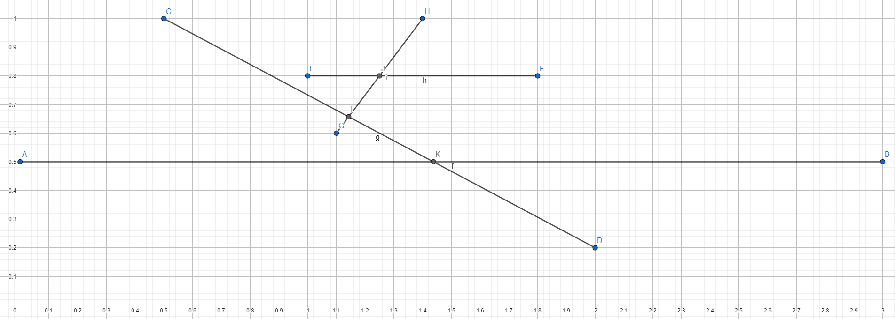

# Sweep Line (Bentley-Ottmann) Algorithm

- Nicolas Bissig
- Antonino Grasso

Source code is located in GitHub: <https://github.com/hm-projects/cg-3-sweep-line>

## Problem description

Count and find all intersections between a set of line segments using the sweep line algorithm.

## Quick overview

Implementation: [Rust](https://www.rust-lang.org/) \
For visualizations: [Python](https://www.python.org/) & [Matplotlib](https://matplotlib.org/)

### Program usage

Requirements:

- Rust > 1.69,
- Python > 3.10 with `requirements.txt` installed

```sh
$ cargo run --release -q .\data\s_1000_10.dat
[2023-07-14T12:11:26Z INFO  cg_3_sweep_line] Processing file .\data\s_1000_10.dat
[2023-07-14T12:11:26Z INFO  cg_3_sweep_line] Initializing events: 356.30µs
[2023-07-14T12:11:26Z INFO  cg_3_sweep_line] Sweeping line: 1.41ms
[2023-07-14T12:11:26Z INFO  cg_3_sweep_line] Total elapsed: 1.77ms
[2023-07-14T12:11:26Z INFO  cg_3_sweep_line] intersections: 796
[2023-07-14T12:11:26Z INFO  cg_3_sweep_line] Wrote intersections to file .\data\s_1000_10.dat.i
$ # visualize results using interative matplotlib figure
$ python .\visualize.py .\data\s_1000_10.dat
```

An interactive matplotlib figure will open, showing the line segments and their intersections.
Use the magnifying glass icon to zoom in and out for closer inspection of the intersections.

### Output

In the following the output for the data set `s_1000_10.dat` is shown.

 \
Figure 1: Segments and intersections for sample dataset, image is in SVG format, so zoom in for better resolution

We want to highlight some sections of the output, which might be of interest.
Please see the axis labels in the figures to find the location in Figure 1.
Click to expand the sections, if viewed in a browser.

<details>
<summary markdown="span">Looks like a missed intersection, but misses really close</summary>

</details>

<details>
<summary markdown="span">Seems like a multi intersection point</summary>

</details>

## Algorithm & Implementation

### Requirements

The following requirements must be met with the input data set, and the implementation detects if this is not the case.

- No duplicate points
- No line segments with length 0
- No vertical line segments (same x coordinate for both points)
- No colinear / overlapping points, as intersection points must be unique

### Usage

```rust
let lines: Vec<Line> = read_file(file_path);
let queue: EventQueue = EventQueue::new(lines);
let intersections: BTreeSet<Point> = queue.sweep();
```

### Data structures

- `EventQueue` is a `BTreeSet` of `Events` with point and associated line segments
  - The events are ordered by their points
- `SweepLine` is `Vec` of `LineSegments` with `y` value
  - The vector is sorted by the `y` value of the line segments
  - This structure is often sorted, however the `sort` algorithm from the rust standard library is, according to the documentation, very efficient if the vector is already mostly sorted, which is the case here, see the documentation:
    > The current algorithm is an adaptive, iterative merge sort inspired by timsort. It is designed to be very fast in cases where the slice is nearly sorted, or consists of two or more sorted sequences concatenated one after another.

### Sweeping Pseudo code

The following pseudo code is used to implement the sweep line algorithm.
Keep in mind, this is only pseudo code, and the actual implementation might differ.

```rust
// in event_queue.rs
fn sweep(mut self) -> BTreeSet<Point> {
    let mut sweep_line = SweepLine::new();

    while let Some(event) = self.pop_first() {
        // popping the next event ensures that the sweep line never goes backwards

        // update all line segments to their current y value at x
        sweep_line.update(event.point().x);

        match event {
                Event::Begin { point, line } => {
                    // Inserting also ensures the ordering of the sweep line
                    sweep_line.insert(point.y, line);

                    let neighbors = sweep_line.get_neighbors(&line);

                    if let Some(intersection_point) = line.intersection(neighbors.above) {
                        // adding the intersection event makes sure that the event is to the "right" of the sweep line, and was never seen before
                        self.add_intersection_event(intersection_point, line, line_above);
                    };
                    // the same is performed for neighbor below
                },
                Event::End { point: _, line } => {
                    let neighbors = sweep_line.get_neighbors(line);

                    if let Some(intersection_point) = line_below.intersection(line_above) {
                        self.add_intersection_event(intersection_point, line_below, line_above);
                    };

                    sweep_line.remove(line);
                },
                Event::Intersection {
                    point: intersection_point,
                    line,
                    other_line,
                } => {
                    // this swaps the two lines in the sweep line, and returns the new neighbors
                    let swapped = sweep_line.swap_and_get_new_neighbors(
                        line,
                        other_line,
                        intersection_point,
                    );

                    // test for intersections after swap
                    if let Some(intersection_point) = swapped.bigger.intersection(line_above) {
                        self.add_intersection_event(intersection_point, swapped.bigger, line_above);
                    };
                    // same is done for other pair
                },
        }
    }

    return self.intersection_points;
}
```

### Updating the sweep line

The sweep line is updated by iterating over all line segments, and updating their `y` value at the current `x` coordinate of the sweep line.
This must be done because the following example would not be detected as an intersection, if the sweep line is not updated:



```rust
// in sweep_line.rs
pub fn update(&mut self, x: f64) {
    // for every line, update the y value to be .y(x)
    for element in self.elements.iter_mut() {
        element.y = element.line.y(x);
    }
    self.elements.sort();
}
```

### Swapping

The swapping of two line segments in the sweep line is implemented as follows, again pseudo code:

```rust
// in sweep_line.rs
// sample the points a bit to the right of the sweep line
let delta = 1e-9;
self.elements[index_line].y = line1.y(intersection_point.x + delta);
self.elements[index_other_line].y = line2.y(intersection_point.x + delta);

self.elements.sort();
```

The lines are sampled "a bit to the right" of the sweep lines, and get their `y` value updated, which ensures correct ordering after the following sort.

### Finding intersection points

We use the following algorithm to find intersection points between two line segments:

```rust
// in geometry.rs, Line::intersection
pub fn intersection(&self, other: &Line) -> Option<Point> {
    let p1 = &self.p;
    let p2 = &self.q;
    let q1 = &other.p;
    let q2 = &other.q;

    let ccwq1 = ccw(p1, p2, q1);
    let ccwq2 = ccw(p1, p2, q2);
    if ccwq1 * ccwq2 > 0.0 {
        return None;
    }

    let ccwp1 = ccw(q1, q2, p1);
    let ccwp2 = ccw(q1, q2, p2);
    if ccwp1 * ccwp2 > 0.0 {
        return None;
    }

    if ccwq1 == 0.0 && ccwq2 == 0.0 && ccwp1 == 0.0 && ccwp2 == 0.0 {
        panic!("Two colinear lines were detected: {:?}, {:?}", self, other);
    }

    // Determine intersection point
    let r_ab = (ccwq2 / ccwq1).abs();
    let a = r_ab / (r_ab + 1.0);
    let i_x = q2.x + a * (q1.x - q2.x);
    let i_y = q2.y + a * (q1.y - q2.y);

    Some(Point { x: i_x, y: i_y })
}
```

Please take a look at the following GeoGebra sketch for an interactive "proof": <https://www.geogebra.org/calculator/zckac62j>

The ratio between two CCW values is used to determine the intersection point.

## Benchmarking and comparing to brute force

Passing the `s_1000_10.dat` data set to the code of [Assignment 1](https://github.com/hm-projects/cg-1-lines), we get `796` intersections.
This implementation achieves the same result.

The datasets provided in assignment 1 do not meet the requirements of this algorithm, and thus cannot be compared. We try to give comparisons by generating our own datasets.

Comparing the runtime of both implementations, we get the following results:

| Implementation | Runtime | Intersections |
| -------------- | ------- | ------------- |
| Brute Force    | 1.5ms   | 796           |
| Sweep Line     | 1.75ms  | 796           |

We generated some datasets with more line segments, and compared the runtime of both implementations.
The datasets contain `n` line segments, with a length ranging from `]0, 10]` units, and are spread in the given ranges.
For the largest dataset, the spread is increased, to still have a low amount of intersections.

| Data set | Description | Brute Force | Sweep Line | Intersections |
| -------- | ----------- | ---------- | ------------- | ------------- |
| [s_1000_10.dat](doc/imgs/s_1000_10.dat.svg) | Sample dataset | ~1.5ms | ~1.75ms | 796 |
| [gen_1000_10.dat](doc/imgs/gen_1000_10.dat.svg) | 1000 segments, [0, 1000] | ~1ms | ~600µs | 6 |
| [gen_10000_10.dat](doc/imgs/gen_10000_10.dat.svg)| 10000 segments, [0, 1000] | ~110ms | ~11ms | 799 |
| [gen_100000_10.dat](doc/imgs/gen_100000_10.dat.svg)| 100000 segments, [0, 10000] | ~10s| ~110ms | 806 |

As can be seen, the sweep line algorithm beats the brute force implementation immensely if the number of intersections is low.
